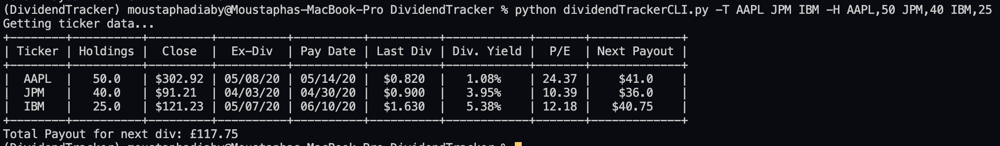
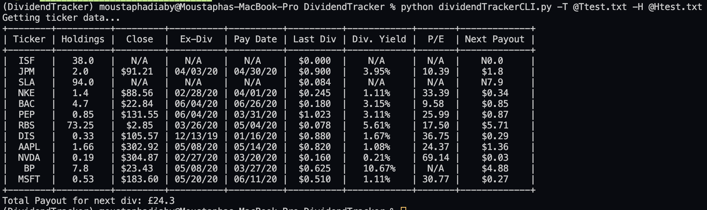

# What does it do?

- The Application takes a list of stock Tickers that issue out dividend and outputs their Ex-dividend data, Payout date, Dividend yield and the amount that is paid out.

- The Application can also take in a second stock list that has your holdings. From which the program will tell you how much you should earn from each holdings

- All this will be displayed via the command line in a clean table.

# Why I created this?

  
I needed a way to quickly see the stock holdings in my holding were close to going Ex-div so that i could expect income from them. I found it annoying manually going to sites like SeekingAlpha and manually checking it for each of my holding.

# How to use?

> ### **Before you get started**
> Install the required python library by using the following command: 
> `pipenv install`

The help command is `python dividendTrackerCLI.py -h`

**To add tickers to pul**l, you can simply type eg:
`python dividendTrackerCLI.py -T AAPL JPM IBM`
Or by specifying a file with @<filename.txt> eg:
`python dividendTrackerCLI.py  -T @Ttest.tx`
>Note:
>- All the tickers must be on a newline when using a file!

**To add your holding**, you can simply type eg:
`python dividendTrackerCLI.py -T AAPL JPM IBM -H AAPL,50 JPM,40 IBM,25`

Or similarly you can specify a file  file with @<filename.txt> eg
`python dividendTrackerCLI.py -T AAPL JPM IBM -H @Htest.txt`
>Note:
>- Your number of holdings is the value after the comma.
>- All the tickers and holdings must be on a newline when using a file!
>- You must specify the ticker in both -T and -H otherwise the program wont fetch the ticker data.

- Run the demo portfolio:
 `python dividendTrackerCLI.py  -T @Ttest.txt -H @Htest.txt`

  

**Author Moustpha Isaac Diaby 16/10/20**
